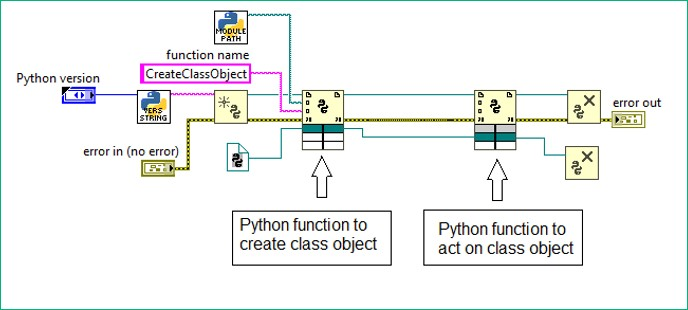

Computation as it exists today is fragile and fragile systems cannot scale. This limits the usefulness of computation as a tool to help solve global-scale problems. Problems like severe weather events, cascading financial failures, and novel infectious diseases require timely coordinated responses between multiple parties that may be geographically and culturally separated. In theory, systems should make use of computation to coordinate efforts according to mutually agreed-upon rules, improving response times and mitigating damage. In practice, we discover that the systems we have built all-too-often fail at the worst possible times.

Fragility in computation is a problem that we can overcome. The techniques of formal verification allow us to prove that our designs correctly solve a specified problem. For example, we may want to prove that a communication system correctly delivers messages. In this case, operating correctly means that the message sent and the message received are identical. However this immediately raises some questions:

1. What is a messsage?
2. What does it mean to transmit a message?
3. What does it mean for two messages to be identical?

If we're talking about text stored in a computer, a message is a collection of 0s and 1s that have some agreed-upon meaning as a string of text. If we're talking about voice messages sent over analog radio signals, the meaning is quite different! The definitions of "transmit" and "identical" then depend on this meaning. Being formal requires the designer to make their design decisions explicit and tells others about when the system will function as intended and when it won't.

Compare this to most software and hardware that is built today. In software, applications are developed rapidly by stringing together bits and pieces of large software libraries. These libraries are rarely verified for correctness and do not make their failure conditions explicit. In this way, the applications that rely on these libraries are fragile. In hardware, a similar problem arises. Hardware systems are built from collections of smaller components, each of which is usually unverified. The aggregate system then fails at unexpected times due  to the interacting failures of its components.

The result is that as systems grow more and more complex, we have less and less certainty about their correctness. At some point the system becomes so fragile that we cannot continue scaling. This can be understood abstractly by realizing that a composite system is almost never more correct than its individual components. Failure cases are additive at best.

Formal verification allows us to scale systems without speculation. When the failure cases are made explicit, we can know beforehand when a system will fail and can hopefully take measures to prevent it. The problem with formal verification is that it is currently inaccessible to most people. The tools used in formal methods are highly techincal and have uninviting user interfaces.

To provide a concrete example of how challenging these tools are to use, consider these examples using Coq and Agda. Here I define what natural numbers are (0,1,2,3, and friends), what addition of natural numbers means, and then prove that `a + b = b + a` for all natural numbers `a` and `b`:

```coq
Inductive Nat : Type :=
| zero : Nat
| suc  : Nat -> Nat
.
    
Fixpoint add (a b : Nat) : Nat :=
match a with
| zero => b
| suc n => suc (add n b)
end.

Notation "a + b" := (add a b).

Theorem add_comm : forall a b , a + b = b + a.
Proof.
intro.
induction a.
* simpl.
  induction b.
  - reflexivity.
  - simpl.
    rewrite <- IHb.
    reflexivity.
* simpl.
  induction b.
  - simpl.
    f_equal.
    rewrite IHa.
    reflexivity.
  - simpl.
    f_equal.
    rewrite IHa.
    simpl.
    rewrite <- IHa.
    apply IHb.
Qed.
```

Here is a similar construction using Agda. In this case I also need to define what equality means.

```agda
infix 4 _≡_
data _≡_ {A : Set} (x : A) : A → Set where
  instance refl : x ≡ x

sym : ∀ {A : Set} {x y : A}
  → x ≡ y
  → y ≡ x
sym refl = refl

trans : ∀ {A : Set} {x z : A}
  → (y : A)
  → x ≡ y
  → y ≡ z
  → x ≡ z
trans _ refl refl = refl

cong : ∀ {A : Set} {x y : A}
  → (f : A → A)
  → x ≡ y
  → f x ≡ f y
cong f refl = refl

data ℕ : Set where
  zero : ℕ
  suc  : ℕ → ℕ

_+_ : ℕ → ℕ → ℕ
zero    + a = a
(suc n) + a = suc (n + a)

+-zero : ∀ (a : ℕ) → a + zero ≡ a
+-zero zero = refl
+-zero (suc n) = trans (suc (n + zero)) refl (cong suc (+-zero n))

+-suc-comm : ∀ (a b : ℕ)
  → suc a + b ≡ a + suc b
+-suc-comm zero b = refl
+-suc-comm (suc n) b =
  trans (suc (suc n + b)) refl
    (trans (suc (n + suc b)) (cong suc (+-suc-comm n b)) refl)

+-comm : ∀ (a b : ℕ) → a + b ≡ b + a
+-comm zero b = trans b refl (sym (+-zero b))
+-comm (suc n) b =
  trans (suc (n + b)) refl
    (trans (suc (b + n)) (cong suc (+-comm n b))
      (trans (suc b + n) refl (+-suc-comm b n)))

```

My commendations to those who actually tried to interpret what any of that means! While techincally correct, these proofs are massively inaccessible to all but a brave few specialists.

One of the key problems is that while code is *sequential*, logic is not. Logical arguments depend on building up a collection of information and then combining that information to synthesize new insights. Sequential, language-based models are simlpy not conducive for logic.

One way that programming languages have broken free from the constraints of sequentiality is the use of Visual Programming Languages (VPLs). VPLs describe computational processes as flow chart, or directed graph, of smaller processes. These processes can then be composed into yet larger processes, and so on. VPLs like National Instruments' LabView have enabled domain experts and engineers to describe computational processes without ever needing to learn a language-based programming paradigm like C, Python, or Haskell. However existing VPLs suffer from a lack of expressivity that is needed to prove the correctness of the computations they describe.



https://www.ni.com/en/shop/labview/using-python-matlab-and-c-with-labview.html

Dependent type theory is the mathematical basis on which proof-capable programming languages are built. A dependently-type VPL is my first research goal. To reach this goal, I plan to use the existing body of research in the field of Applied Category Theory. String diagrams, a form a visual reasoning for category theory, are an inroads to designing a dependently-type VPL for many processes of human interest, including both classical and quantum computation, computer hardware, and non-traditional computing media like biological systems. It is my hope that this line of research will yield an artifact that is both mathematically beautiful and practically useful in the effort to include more minds in the quest to solve humanity's biggest problems.
